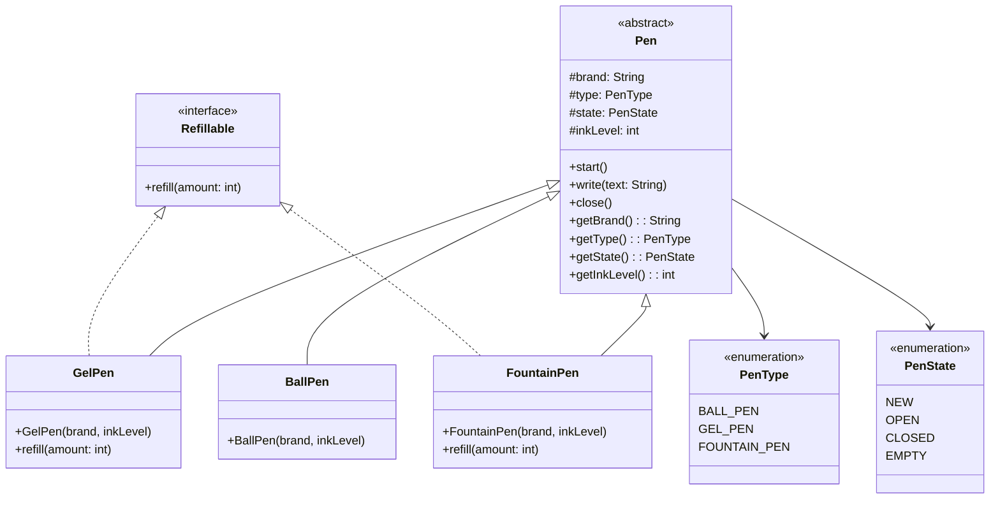

# LLD Assignment – Design a Pen

## Problem Statement

Design a `Pen` with the following core operations:
- `start()` – open/uncap the pen so it is ready to write
- `write(text)` – write some text (consumes ink)
- `close()` – cap the pen
- `refill(amount)` – refill ink (only supported by certain pen types)

---

## Assumptions

1. Every pen has a **brand**, a **type** (Ball / Gel / Fountain), an **ink level** (0–100), and a **state**.
2. A pen must be **opened** before it can write.
3. Writing consumes ink — each character uses 1 unit of ink (simplified).
4. When ink hits 0 the pen's state becomes `EMPTY`.
5. **BallPen** is NOT refillable (disposable). **GelPen** and **FountainPen** ARE refillable.
6. Refilling an `EMPTY` pen transitions its state back to `CLOSED` (ready to open again).
7. Ink level is capped at 100 after a refill.

---

## Design Explanation

| Class / Interface | Role |
|---|---|
| `PenType` (enum) | Distinguishes BALL_PEN, GEL_PEN, FOUNTAIN_PEN |
| `PenState` (enum) | Tracks lifecycle: NEW → OPEN ↔ CLOSED → EMPTY |
| `Refillable` (interface) | Contract for pens that support `refill()` |
| `Pen` (abstract class) | Common attributes + default implementations of `start`, `write`, `close` |
| `BallPen` | Extends `Pen`, does NOT implement `Refillable` |
| `GelPen` | Extends `Pen`, implements `Refillable` |
| `FountainPen` | Extends `Pen`, implements `Refillable` |
| `Main` | Demo / driver class |

**Key OOP ideas used:**
- **Abstraction** – `Pen` is abstract; callers program to the `Pen` type.
- **Inheritance** – All pen types share common behaviour from `Pen`.
- **Polymorphism** – Each concrete pen can be used as a `Pen` reference.
- **Interface segregation** – `Refillable` is a separate interface so non-refillable pens don't carry unused methods.

---

## Class Diagram (Mermaid)



---

## Project Structure

```
pen-design/
├── README.md
└── src/
    └── pen/
        ├── PenType.java       # enum – pen types
        ├── PenState.java      # enum – pen lifecycle states
        ├── Refillable.java    # interface – for refillable pens
        ├── Pen.java           # abstract base class
        ├── BallPen.java       # concrete – not refillable
        ├── GelPen.java        # concrete – refillable
        ├── FountainPen.java   # concrete – refillable
        └── Main.java          # demo / driver
```

---

## How to Run

```bash
# From the pen-design directory
cd src
javac pen/*.java
java pen.Main
```

### Expected Output (abbreviated)

```
===== Ball Pen Demo =====
[Reynolds] Pen opened. Ready to write. Ink: 10%
[Reynolds] Writing: "Hello" | Ink left: 5%
[Reynolds] Writing: "World" | Ink left: 0%
[Reynolds] Ink just ran out!
[Reynolds] Cannot write – pen is not open (current state: EMPTY).
[Reynolds] Pen is already closed.

===== Gel Pen Demo =====
[Pilot] Pen opened. Ready to write. Ink: 5%
[Pilot] Writing: "Hi" | Ink left: 3%
[Pilot] Writing: "Okay" | Ink left: 0%
[Pilot] Ink just ran out!
[Pilot] Cannot start – pen is empty.
[Pilot] Gel pen refilled. Ink: 50%
[Pilot] Pen opened. Ready to write. Ink: 50%
[Pilot] Writing: "Refilled!" | Ink left: 41%
[Pilot] Pen closed.

===== Fountain Pen Demo =====
[Parker] Pen opened. Ready to write. Ink: 80%
[Parker] Writing: "Low Level Design" | Ink left: 64%
[Parker] Pen closed.
[Parker] Cannot write – pen is not open (current state: CLOSED).
[Parker] Fountain pen refilled. Ink: 84%
Ink after refill: 84%
```

---

## State Transitions

```
NEW ──start()──► OPEN ──write() until ink=0──► EMPTY
                  │                               │
                close()                        refill()  (only Refillable pens)
                  │                               │
                CLOSED ◄───────────────────────────
```
