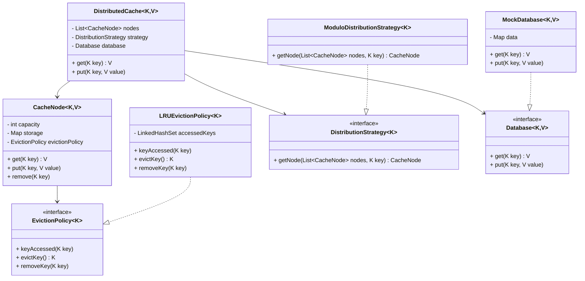

# Distributed Cache LLD

This folder contains the Low-Level Design (LLD) for a Distributed Cache System.

## Architecture

The system consists of the following key components:
1.  **DistributedCache**: The orchestrator which redirects `get` and `put` operations.
2.  **CacheNode**: Represents a single cache instance holding data. Contains its own map and eviction policy.
3.  **DistributionStrategy**: An interface that decides which `CacheNode` corresponds to a given key.
4.  **EvictionPolicy**: An interface to manage eviction when a `CacheNode` hits its capacity.
5.  **Database**: Mock interface representing the persistent storage.

## Data Distribution
The system uses the `DistributionStrategy` interface to determine which node handle which key. Currently, `ModuloDistributionStrategy` is implemented, which calculates `hash(key) % numberOfNodes` to route requests. This ensures that the same key always hashes to the same node in a static configuration.

## Cache Miss Handling
When a `get(key)` is invoked:
1. The `DistributedCache` uses the distribution strategy to find the relevant node.
2. It queries the node.
3. If the value is present (Cache Hit), it returns the value directly.
4. If the value is absent (Cache Miss), it consults the `Database`.
5. It then stores the fetched value into the chosen `CacheNode`.
6. Lastly, it returns the value to the caller.

## Eviction
Each `CacheNode` operates with a configurable capacity limit and manages an `EvictionPolicy`. The current default is `LRUEvictionPolicy`.
- When a key is read or written, `keyAccessed(key)` updates the key to be recently used.
- When the internal map reaches full capacity on `put`, `evictKey()` is called to find the least recently used key and drops it from the map.

## Extensibility
The design is highly flexible:
1.  **Pluggable Distribution Strategy**: `ModuloDistributionStrategy` can easily be replaced by `ConsistentHashingStrategy` by creating a new class implementing `DistributionStrategy`.
2.  **Pluggable Eviction Policy**: Similarly, `LRUEvictionPolicy` can be replaced with `MRUEvictionPolicy` or `LFUEvictionPolicy` by implementing the `EvictionPolicy` interface.

## Class Diagram

