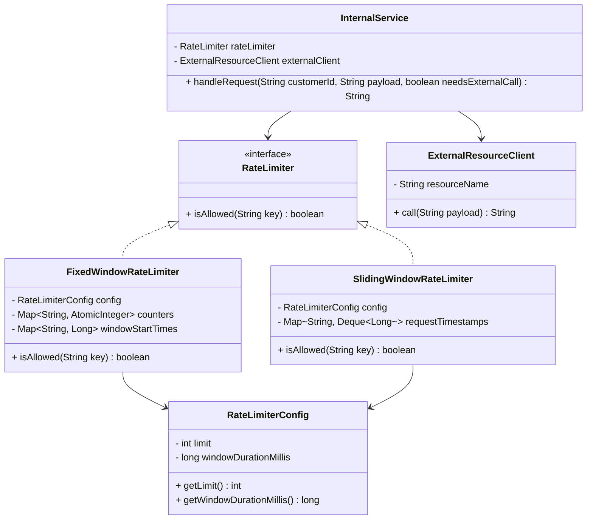

# Rate Limiter LLD — Pluggable Rate Limiting System

This module implements a pluggable, extensible rate limiting system for controlling external resource usage.

---

## Problem Statement

A client calls an API → the API forwards to an internal service → the internal service **may or may not** call an external (paid) resource.  
Rate limiting should **only** apply at the point of the external call, not on every incoming API request.

---

## Architecture

```
ClientAPI
   │
   ▼
InternalService
   │
   ├── (business logic: no external call needed?) → return local result
   │
   └── (external call needed?)
           │
           ▼
       RateLimiter.isAllowed(key)?
           │
           ├── YES → ExternalResourceClient.call()
           └── NO  → Return RATE_LIMITED
```

---

## Class Diagram



---

## Implementations

### 1. Fixed Window Counter
- Divides time into fixed-size windows (e.g., every 60 seconds).
- A counter is incremented per request within the current window.
- When the window expires, the counter resets.
- **Pros**: Simple, memory-efficient (O(1) per key).
- **Cons**: Boundary problem — a burst of requests at the end of one window and the start of the next can allow **2× the limit** through.

### 2. Sliding Window Counter
- Maintains a log of exact timestamps for each request within the last `windowDuration` milliseconds.
- On each request, stale timestamps are evicted from the front of the deque.
- **Pros**: Precise, no boundary burst problem.
- **Cons**: Higher memory usage — O(limit) timestamps per key.

---

## Trade-off Summary

| Property | Fixed Window | Sliding Window |
|---|---|---|
| Memory per key | O(1) | O(limit) |
| Fairness | Boundary burst issue | Accurate, no burst |
| Implementation complexity | Low | Medium |
| Best for | High-throughput, approximate limits | Strict, accurate limiting |

---

## Key Design Decisions

1. **`RateLimiter` is an interface** — `InternalService` depends only on the abstraction. Switching from `FixedWindowRateLimiter` to `SlidingWindowRateLimiter` (or a future `TokenBucketRateLimiter`) requires zero changes in `InternalService`.

2. **Rate limiting key is caller-defined** — The key can be `customer:T1`, `tenant:acme`, `apikey:xyz`, or `provider:openai`. This gives full flexibility per use case.

3. **`RateLimiterConfig` is a separate class** — Limits and window durations are configurable without modifying the algorithm class.

4. **Thread safety** — Both implementations use `synchronized` on the `isAllowed` method. For production, a striped lock (e.g., `Guava Striped`) per key would give better throughput.

5. **Rate limiting is NOT applied when no external call is needed** — The check lives inside `InternalService.handleRequest()` behind a `needsExternalCall` flag, fulfilling the core requirement precisely.

---

## Extending with Future Algorithms

To add **Token Bucket**:
```java
public class TokenBucketRateLimiter implements RateLimiter {
    // Implement isAllowed() using token refill logic
}
```
Then simply inject it into `InternalService` — no other code changes needed.
